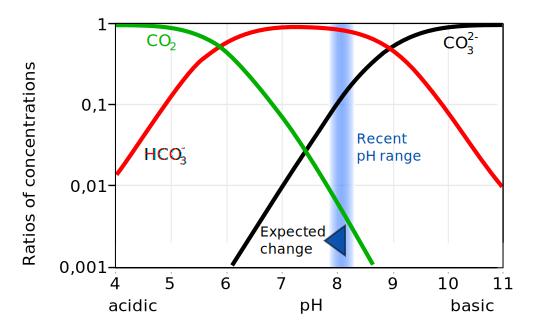

# Terms and definitions

## Net Ecosystem Carbon Balance
Note that we are using the naming convention of Chapin 2006 at the exception of NEE.
We are using ecologist convention so NEE in this document equal -NEE in chapin 2006 (Atmospheric convention for NEE in chapin 2006).

The carbon balance a natural ecosystem is describe as follow :

$$ NECB = \frac{dC}{dt} = F_{CO_{2}} + F_{CH_{4}} + F_{DOC} + F_{DIC} +  F_{PC} + F_{CO} + F_{VOC} $$

With the Net Ecosystem Carbon Balance (NECB) beeing the sum of carbon fluxes entering (positive values) or leaving (negative values) the ecosystem.

Limpens 2008 :

> The NECB for northern peatlands from measurements is quite conservative ranging between
> 10 to 30 g C m^-2^ yr^-1^.

range (Limpens 2008) : 

* NEE : 0 -- 100 g C m^-2^ yr^-1^
* $F_{CH_{4}}$ : 0 -- 12 g C m^-2^ yr^-1^
* DC (DOC + DIC) : 2 -- 70 g C m^-2^ yr^-1^ (higher values : perturbations)

> Examining the NECB with all its terms makes it clear that the exclusion of $CH_{4}$ and DC losses
> could lead to an error in excess of 100 %.

## The different fluxes

### $F_{CO_{2}} \equiv NEE$

This term correspond to the gazeous $CO_{2}$ flux of the ecosystem.
It is measured monthly with a closed static chamber method using a vaisala probe.

### $F_{CH_{4}}$
### $F_{DOC}$
The Dissolved Organic Carbon

Order of magnitude : 

* riverwater : 1-30 ppm
* seawater : 0.5 ppm
* rainwater : < 1 ppm
* groundwater : < 1 ppm
* organic horizon : sometimes > 100 ppm

Limpens 2008 :

> DOC concentrations are usually betwwen 20 and 60 mg/l in northern peatlands (Blodau, 2002)
> but concentrations aur higher during low flow periods.

> Buffam et al. (2007) reported DOC export for 15 Swedish peatland streams at 2--10 g C m^-2^ yr^-1^
> while DIC was between 0.2 and 2 g C m^-2^ yr^-1^.

Warning in the citation above : peatland streams 

### $F_{DIC}$

The Dissolved Inorganic Carbon form 

* carbon dioxide : $CO_{2}$ (fr : dioxide de carbone)
* carbonic acide : $H_{2}CO_{3}^{-}$ (fr : acide carbonique)
* bicarbonate : $HCO_{3}^{-}$ (fr : bicarbonate)
* carbonate : $CO_{3}^{2-}$ (fr : carbonate)

$$ CO_{2}+H_{2}O \rightleftharpoons H_{2}CO_{3}^{-}  \rightleftharpoons H^{+}+HCO_{3}^{-}  \rightleftharpoons 2H^{+}+CO_{3}^{2-}  $$

This equation is driven by the pH as shown in the figure below which present the species dominance in seawater.

http://en.wikipedia.org/wiki/Bjerrum_plot#mediaviewer/File:Carbonate_system_of_seawater.svg

Having the DIC and the pH allow us to recalculate the specie proportions and quantities

### $F_{PC}$

The Particulate Carbon

### $F_{CO}$

### $F_{VOC}$

The Volatile Organic Carbon